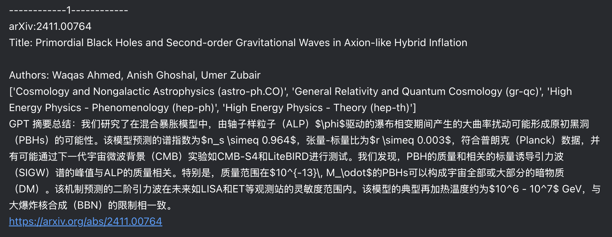

<!--
 * @Author: Yiqian Qian
 * @Description: file content
 * @Date: 2021-11-21 14:26:36
 * @LastEditors: Yiqian Qian
 * @LastEditTime: 2024-11-04 18:50:43
 * @FilePath: /arxiv_scraper_GPT/README.md
-->

# DailyArxivGPT

## Never missing your interested arxiv paper with _DailyArxivGPT_.

DailyArxivGPT can scrape new arXiv papers in your areas of interest, summarize the abstracts using ChatGPT, and then email them to you and your recipients.

**NOTE**: ChatGPT summarizing function requires OpenAI api services, you can either use the official one or buy a third party api token at [GPTNB](https://oneapi.gptnb.ai)

# Example

